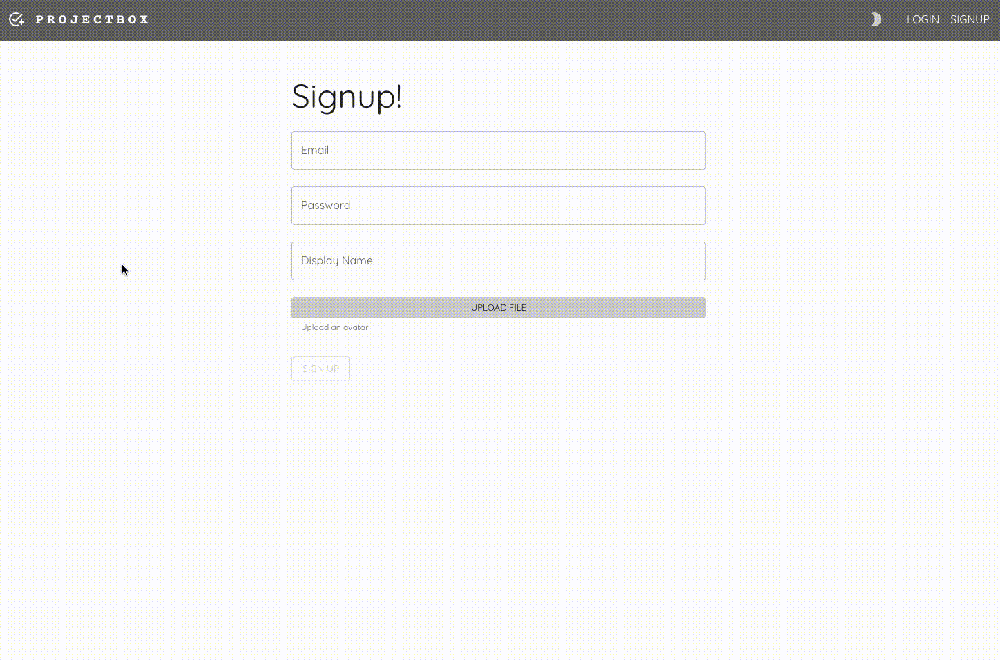
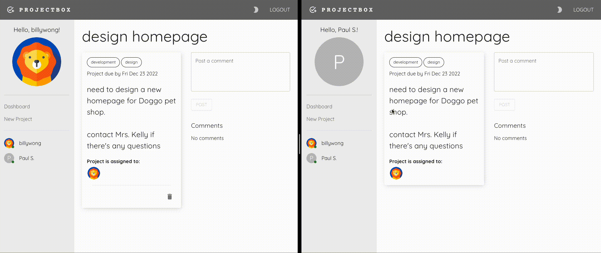

# PROJECTBOX

PROJECTBOX is a project management application that allows registered users to view and create projects that need to be monited by each other.

This application is built using React and Material UI for the user interface, while the backend (including authentication) part is managed by Firebase.

## UPDATES!

### Dec 16, 2022

PROJECTBOX is now live for anyone that wants to play around with it

Click [here](https://projectbox-175a1.firebaseapp.com/login) to see :)

## Special Features

### Forms

All forms are built using [Formik](https://formik.org/) and [YUP](https://github.com/jquense/yup) (for verification). Each form field will display an error message, if any, if it does not pass YUP's requirements. Forms cannot be sumbitted until all requirements are fulfilled and once Firebase has processed and returned data, form fields will be reset and users will be redirect to specific page.

<em>To update a file for avatar is optional, however if user decided to update a file, file size cannot exceed 100kb. (Error message will be displayed and sign up is prohibited if file size is greater than 100kb.)</em>

### Live Update

All projects include a comment section for registered users to enter messages, new messages will be rendered automatically without user reloading the page.

Another live update is user status, whenever user is logged in, a green badge will appear beside their avatar.

### Responive Design & Modes

PROJECTBOX's layout is designed to fit a wide range of devices. In addition, user is capable of switich light and dark mode based on their preferences.

## Usage

- run `git clone git@github.com:bwong-yh/projectbox.git`
- navigate to `projectbox` directory
- run `npm install` to install dependencies
- run `npm run start` to start Webpack Development Server and browser should launch automatically
  - you can always enter `http://localhost:3000` in the address bar to launch the app
- log in using default email and password
  - `billy@dev.com` and `test1234`
- OR sign up using any email and password

## Coming Updates

- allow users to edit / update project content and comment content
- allow users to update their profile
- direct messaging between users
- limit certain users to view certain projects

## Dependencies

- "@emotion/react": "^11.10.5"
- "@emotion/styled": "^11.10.5"
- "@mui/icons-material": "^5.10.16"
- "@mui/material": "^5.10.17"
- "@testing-library/jest-dom": "^5.16.5"
- "@testing-library/react": "^13.4.0"
- "@testing-library/user-event": "^13.5.0"
- "date-fns": "^2.29.3"
- "firebase": "^9.14.0"
- "formik": "^2.2.9"
- "react": "^18.2.0"
- "react-dom": "^18.2.0"
- "react-router-dom": "^6.4.4"
- "react-scripts": "5.0.1"
- "uuid": "^9.0.0"
- "web-vitals": "^2.1.4"
- "yup": "^0.32.11"
